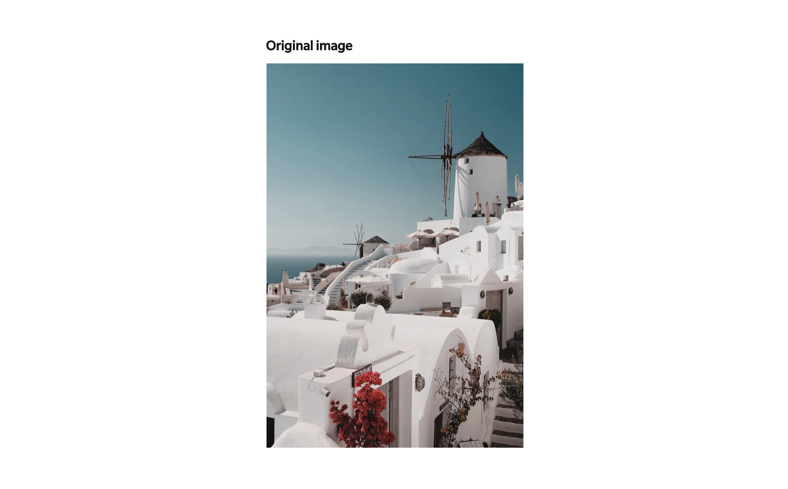
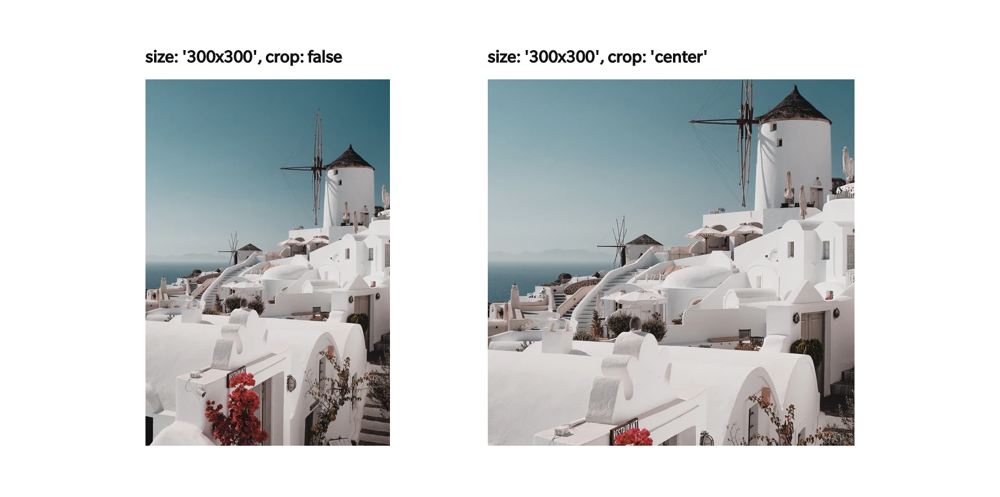
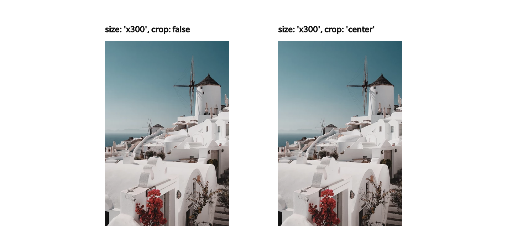
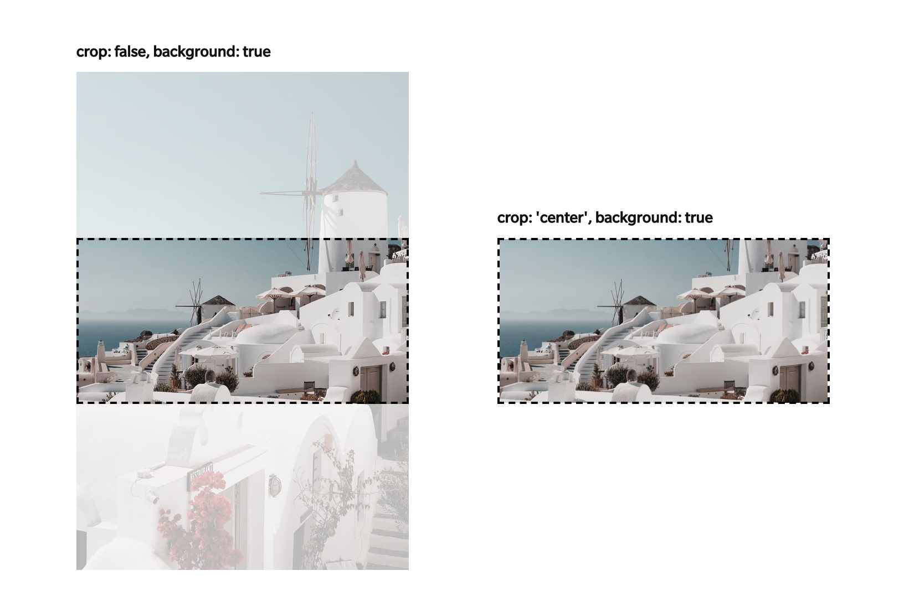

# rimg-shopify
> [rimg](https://github.com/pixelunion/rimg) plugin for Shopify themes.

- [x] Liquid snippet for easy image tags
- [x] Automatic tracking of images in the Shopify theme editor
- [x] Custom event hooks to allow external code to track dynamic images

**Table of contents**

- [Quick start](#quick-start)
- [JS](#js)
  - [`rimg.init(selector, options)`](#rimginitselector-options)
  - [`rimg.watch(el)`](#rimgwatchel)
  - [`rimg.unwatch(el)`](#rimgunwatchel)
  - [`rimg.instance`](#rimginstance)
  - Event: [`theme:rimg:watch`](#event-themerimgwatch)
  - Event: [`theme:rimg:unwatch`](#event-themerimgunwatch)
- [Snippets](#snippets)
  - [`rimg.liquid`](#rimgliquid)


## Quick start

**Add as a dependency:**

`npm install pixelunion/rimg pixelunion/rimg-shopify`

**Include snippet to show an image:**

``

**Hook up javascript for lazy-loading:**

```js
import rimg from 'rimg-shopify';
rimg.init();
```


## JS

### [`rimg.init(selector, options)`](#rimginitselector-options)

Initialize the single global instance of `rimg-shopify`.

Watch lazy-loaded elements on the page and load them as they scroll into view.

#### Parameters
- `selector` *String*: The css selector to track for lazy-loading. Defaults to `[data-rimg="lazy"]`.
- `options` *Object*: Same [options](https://github.com/pixelunion/rimg#rimgselector-options) that `rimg` accepts.


### [`rimg.watch(el)`](#rimgwatchel)

Track an element and its children. This can be used to track new parts of the page that are dynamically added after the initial `init()` call.

#### Parameters
- `el` *Element*: The element to track.


### [`rimg.unwatch(el)`](#rimgunwatchel)

Untrack an element and its children. This should be called on any previously-tracked elements that will be removed from the page.

#### Parameters
- `el` *Element*: The element to untrack.


### [`rimg.instance`](#rimginstance)

Returns the shared global [`rimg`](https://github.com/pixelunion/rimg) instance. Can be used to manually track elements or otherwise interact with rimg.

#### Example

```js
import rimg from 'rimg-shopify';

const el = document.querySelector('.my-image');
rimg.instance.track(el);
```


### Event: [`theme:rimg:watch`](#event-themerimgwatch)

Trigger this event to tell `rimg-shopify` to watch a new element. Calling `watch()` directly is preferred, but this can be used in code that doesn't have access to the global instance (apps or custom code).

#### Example

```js
const el = document.querySelector('.my-image');

// With jQuery
$(el).trigger('theme:rimg:watch');

// With custom events
const event = new CustomEvent('theme:rimg:watch');
el.dispatchEvent(event);
```


### Event: [`theme:rimg:unwatch`](#event-themerimgunwatch)

Trigger this event to tell `rimg-shopify` to unwatch an element. Calling `unwatch()` directly is preferred, but this can be used in code that doesn't have access to the global instance (apps or custom code).


## Snippets

### [`rimg.liquid`](#rimgliquid)

Outputs markup for a responsive image.

Parameters provided to this snippet override ones defined in JS.

#### Parameters
- `img` *ImageDrop*: An Image Drop to display.
- `lazy` *Boolean (optional)*: Lazy-load the image. Outputs markup to connect with the rimg JS. Defaults to `false`.
- `background` *Boolean (optional)*: Output the image markup as a background image. Defaults to `false`.
- `size` *String (optional)*: The size to display the image at. Uses the same syntax as `img_url`. Defaults to the image's natural size.
- `crop` *String (optional)*: The crop type to use. One of: top, center, bottom, left, right. Defaults to no cropping.
- `scale` *Number (optional)*: A number to scale the final image dimensions by. Only applies to lazy-loaded images. Defaults to `1`.
- `format` *String (optional)*: The format type to use. One of: jpg, pjpg. Defaults to original image format.
- `placeholder` *String (optional)*: The size to display to placeholder image at. Uses the same syntax as `img_url`. Only applies if `lazy` is true. Defaults to no placeholder image.
- `alt` *String (optional)*: Alt text for the image. Defaults to `img.alt` or a blank string if none exists.
- `class` *String (optional)*: CSS class names to add to the image tag's `class` attribute.
- `style` *String (optional)*: CSS styles to apply to the image tag's `style` attribute.
- `attr` *String (optional)*: Extra attributes to add to the image tag. For example: `id="example"`.
- `canvas` *Boolean (optional)*: Add an extra element, useful for styling loaders. Defaults to `false`.
- `disable_noscript` *Boolean (optional)*: Eliminates noscript tags, saving data in the cases when they aren't required. Defaults to false.
- `focal_point` *String (optional)*: The focal point set by the merchant for the image in the Shopify admin. Accessed in the image drop via: `image.presentation.focal_point`. Applies `background-size:cover;background-position:{{ focal_point }};` to the style property of the container if the image is a background-image and `object-fit:cover;object-position:[focal point]` otherwise on the image element. Only works with `no cropping`. Defaults to blank.

#### Example: Simple responsive image

```liquid

```

#### Example: Lazy-loaded image with low-res placeholder

```liquid

```

#### Example: Lazy-loaded background image

```liquid
<div
  
></div>
```

#### Size and cropping in detail

The interplay between `size` and `crop` parameters is a bit complicated, but can be very useful when applied correctly. The intention is that rimg will behave the same way as Shopify's `img_url` filter.

Namely:

* Uncropped images will match the original image aspect ratio
* Cropped images will match the requested aspect ratio
* If only one dimension is provided (ie `300x`), the other is calculated automatically based on the original aspect ratio. So yes, cropped and uncropped images will look the same.

In addition, cropping info is passed to `rimg` and used when lazy loading images. For lazy loaded images:

* Uncropped `img` and background images will match the original image aspect ratio **even if the container does not**
* Cropped `img` will load at the requested aspect ratio
* Cropped **background images** will always load at the aspect ratio **of their container.** This is a great way to apply "cover" style background images while only loading the exact portion of the image required.

##### If I'm using lazy loading, why do I need a size parameter?

1. The size is used to generate a svg placeholder, which impacts the size and dimensions of the containing element. Typically you will only care about the aspect ratio, so should apply appropriate styling to ensure the placeholder is correctly scaled on screen, and the resulting image is loaded at the proper size.
2. As a fallback, in case lazy loading fails or is disabled. The size is used to generate the basic `src` string. Because of this you should choose a resolution high enough that it will look good on most devices, but not so high that it causes huge file sizes.

Here are some examples, given this original, high res image.



If both dimensions are provided, uncropped images will load at the original image (natural) aspect ratio. Cropped images will load at the aspect ratio of the requested dimensions.



If only one dimension is provided, the other is calculated automatically based on the original (natural) aspect ratio of the image, so cropped and uncropped images appear identical.



Background images have no intrinsic size, so the size parameter has no effect here! Instead `rimg` will look at the container size and load an image to suit. Uncropped images are loaded at the original aspect ratio while cropped images are loaded with the exact aspect ratio to match the container. For uncropped images, `rimg` automatically looks at the aspect ratio of the image and the container and loads the image at a "cover" resolution, where the short dimension of the image is the same size as the long dimension of the container.


