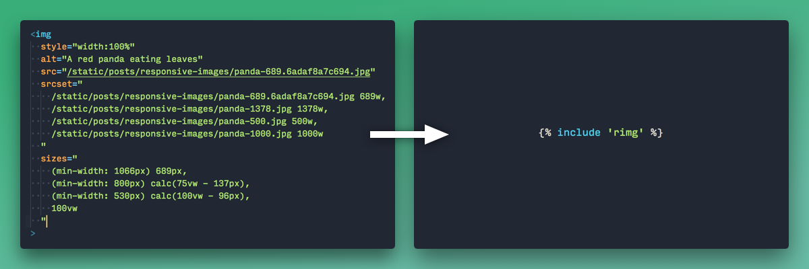

# rimg
> Responsive and lazy-loaded images.

- [x] Fast element tracking with `IntersectionObserver`
- [x] Maintains natural aspect ratios as images load
- [x] Saves bandwidth by loading images with exact display dimensions
- [x] Support for image tags, background images, iframes, and custom elements

rimg aims to make modern images as simple and fast as possible. The classic `` doesn't cut it anymore, but the tech that replaces it comes with a lot of boilerplate and can be difficult to apply correctly.




**Plugins**

[rimg-shopify](https://github.com/pixelunion/rimg-shopify)—Integration with Shopify themes.


**Table of contents**

- [Quick start](#quick-start)
- [Browser support](#browser-support)
- [JS](#js)
  - [`rimg(selector, options)`](#rimgselector-options)
  - [`instance.track(selector)`](#instancetrackselector)
  - [`instance.update(selector)`](#instanceupdateselector)
  - [`instance.untrack(selector)`](#instanceuntrackselector)
  - [`instance.unload()`](#instanceunload)
  - Event: [`rimg:enter`](#event-rimgenter)
  - Event: [`rimg:loading`](#event-rimgloading)
  - Event: [`rimg:load`](#event-rimgload)
  - Event: [`rimg:error`](#event-rimgerror)


## Quick start

**Add as a dependency:**

`npm install pixelunion/rimg`

**Hook up javascript:**

```js
import rimg from 'rimg';
rimg();
```


## Browser support

- Chrome 51+
- Edge 15+
- Firefox 55+
- Safari, IE: requires [`IntersectionObserver` polyfill](https://developer.mozilla.org/en-US/docs/Web/API/Intersection_Observer_API).


## JS

### [`rimg(selector, options)`](#rimgselector-options)

Watch lazy-loaded elements on the page and load them as they scroll into view.

#### Parameters
- `selector` *String|HTMLElement|NodeList*: The css selector, element, or elements to track for lazy-loading. Defaults to `[data-rimg="lazy"]`.
- `options` *Object*
- `options.template` *String*: A template string used to generate URLs for an image. This allows us to dynamically load images with sizes to match the container's size. Defaults to `false`.
- `options.templateRender` *Function (optional)*: A function to turn a template string into a URL. Accepts two parameters: `template` and `size`.
- `options.max` *Object (optional)*: The maximum available size for the image. This ensures we don't try to load an image larger than is possible.
- `options.max.width` *Number (optional)*: Defaults to `Infinity`.
- `options.max.height` *Number (optional)*: Defaults to `Infinity`.
- `options.round` *Number (optional)*: Round image dimensions to the nearest multiple. This is intended to tax the image server less by lowering the number of possible image sizes requested.
- `options.placeholder` *Object (optional)*: The size of the lo-fi image to load before the full image. Defaults to `false` for no placeholder image.
- `options.scale` *Number (optional)*:  A number to scale the final image dimensions by. Only applies to lazy-loaded images. Defaults to 1.
- `options.crop` *String (optional)*: Crop value; null if image is uncropped, otherwise equal to the Shopify crop parameter ('center', 'top', etc.).

#### Returns

*instance*: An object with `track`, `untrack`, and `unload` functions.

#### Example

```js
import rimg from 'rimg';

const lazy = rimg('.promo-image');

// Track a new element
lazy.track('.product-image');

// Stop tracking an element
lazy.untrack('.product-image');

// Stop watching all elements
lazy.unload();
```


### [`instance.track(selector)`](#instancetrackselector)

Add elements to track for lazy-loading. This can be used to track new elements that have been dynamically added to the page.

#### Parameters
- `selector` *String|HTMLElement|NodeList*: Defaults to `[data-rimg="lazy"]`.


### [`instance.update(selector)`](#instanceupdateselector)

Update elements that have already been loaded to recalculate their images. This is useful if the browser has been resized and we need to load in larger images.

#### Parameters
- `selector` *String|HTMLElement|NodeList*: Defaults to `[data-rimg="loaded"]`.


### [`instance.untrack(selector)`](#instanceuntrackselector)

Stop tracking elements. Elements are automatically untracked after they load.

#### Parameters
- `selector` *String|HTMLElement|NodeList*: Defaults to `[data-rimg]`.


### [`instance.unload()`](#instanceunload)

Stop tracking all previously tracked elements and disconnect the `IntersectionObserver`.


### Event: [`rimg:enter`](#event-rimgenter)

The element is entering the viewport. This fires for all types of elements, not only images.

#### Example

```js
const el = document.querySelector('.my-element');
el.addEventListener('rimg:enter', event => alert('scrolled into view!'));
rimg(el);
```


### Event: [`rimg:loading`](#event-rimgloading)

The image URLs have been set and we are waiting for them to load.


### Event: [`rimg:load`](#event-rimgload)

The final image has loaded.


### Event: [`rimg:error`](#event-rimgerror)

The final image failed loading.
